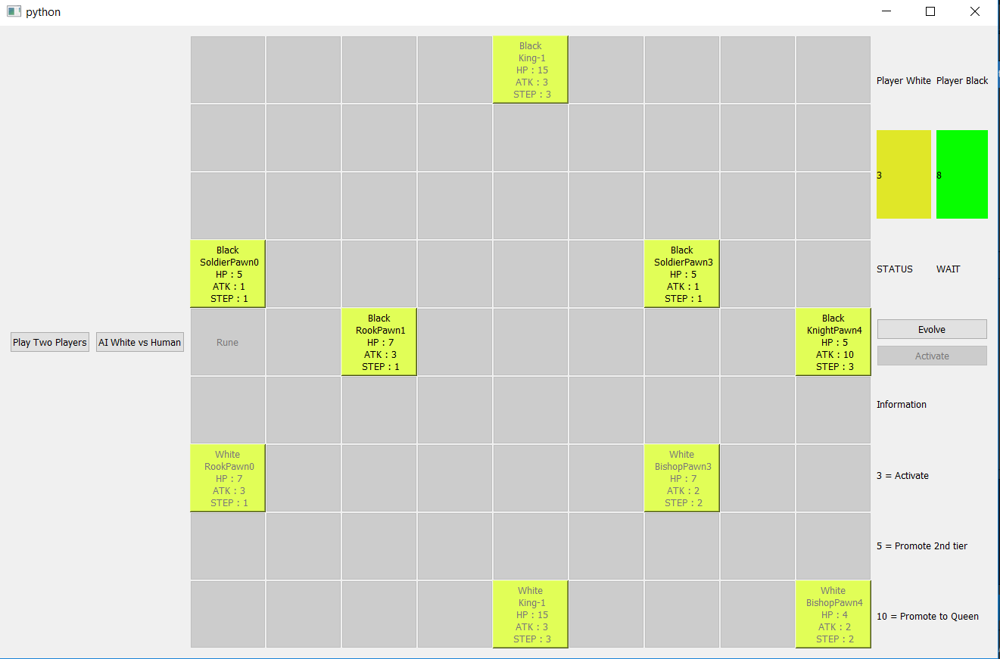

# EvoPawness Game

Based on the article that I write  
Part 1: https://towardsdatascience.com/create-your-own-board-game-with-powerful-ai-from-scratch-part-1-5dcb028002b8  
Part 2: https://towardsdatascience.com/create-ai-for-your-own-board-game-from-scratch-minimax-part-2-517e1c1e3362  
Part 3: https://towardsdatascience.com/create-ai-for-your-own-board-game-from-scratch-alpha-zero-part-3-f22761372245  

This repository has the documentation almost all of functions. Hope that it will make you understand better.

The game will be used to experiment some AI Algorithms. There are two AI Algorithms that have been already implemented:
1. AlphaZero
2. Minimax

## Requirement

1. Python 3.6 (Anaconda Python is preferred)
2. Pandas
3. Tensorflow (For implementing AlphaZero)
4. Keras (For implementing AlphaZero)
5. PtQt5 (For the GUI)

Install Python Anaconda if you haven't
https://www.anaconda.com/download/

install each packages by using `pip install`

## Configuration
You can see `config.py` for the configuration of this program and edit it.
See the `config.py` for further information

## How to use
1. Clone the git repository
2. Do the following accordingly:

*Train AlphaZero without pre-trained model (the model that you have previously trained)*:  
`python main.py train -azt`

*Train AlphaZero from pre-trained model*:  
`python main.py train -aztc`

*Play the game with PyQt5 GUI* :  
`python main.py play -p GUI`

CLI is currently unavailable

## GUI

## Progress
- [x] Add basic elements to be input of AI Algorithm
- [x] Documenting (almost all of them)
- [ ] Fix the mess of the code (need more class and remove unnecessary code
- [x] Create the GUI
- [x] Use classic AI Algorithm
- [x] Experimenting Value-based Reinforcement Learning (Failed with DQN)
- [x] Experimenting Policy-based Reinforcement Learning (Implemented with AlphaZero instead)
- [ ] Improve AlphaZero and implement PPO to this game

## FAQ
Q : Can I Contribute?  
A : Of course, just tell me what you want to contribute.  

Q : Can I Contact you?  
A : email me in haryomaenan@gmail.com if you want to contact me. Especially about this project.
